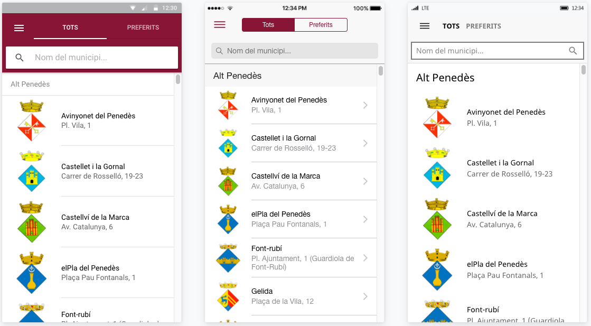
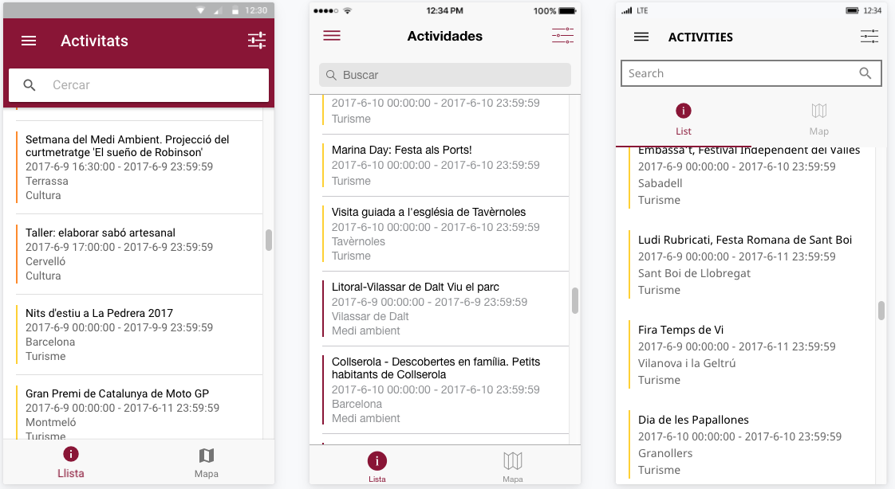

# Diba+Municipis Application

This a example of use of Diputació de Barcelona's Open Data API.

## Table of Contents
 - [Getting Started](#getting-started)
 - [Contributing](#contributing)
 - [Use Cases](#use-cases)
 - [App Preview](#app-preview)
 - [File Structure of App](#file-structure-of-app)


## Getting Started

* Clone this repository: `git clone https://github.com/diputacioBCN/app-municipis.git`.
* Run `npm install` from the project root.
* Install the ionic CLI (`npm install -g ionic`)
* Run `ionic serve` in a terminal from the project root.
* Profit

**Note:** Is your build slow? Update `npm` to 3.x: `npm install -g npm`.


## Contributing
See [CONTRIBUTING.md](https://github.com/diputacioBCN/app-municipis/blob/master/.github/CONTRIBUTING.md?at=master&fileviewer=file-view-default)


## Use Cases

* Menu - [ [template](https://github.com/diputacioBCN/app-municipis/blob/master/src/app/app.html) |
[code](https://github.com/diputacioBCN/app-municipis/blob/master/src/app/app.component.ts) ]
* Municipis - [ [template](https://github.com/diputacioBCN/app-municipis/blob/master/src/pages/municipis/municipis.html) |
[code](https://github.com/diputacioBCN/app-municipis/blob/master/src/pages/municipis/municipis.ts) ]
* Municipis Detail - [ [template](https://github.com/diputacioBCN/app-municipis/blob/master/src/pages/municipis-detail/municipis-detail.html) |
[code](https://github.com/diputacioBCN/app-municipis/blob/master/src/pages/municipis-detail/municipis-detail.ts) ]
* Activities - [ [template](https://github.com/diputacioBCN/app-municipis/blob/master/src/pages/activities/activities.html) |
[code](https://github.com/diputacioBCN/app-municipis/blob/master/src/pages/activities/activities.ts) ]
* Activities Detail - [ [template](https://github.com/diputacioBCN/app-municipis/blob/master/src/pages/activities-detail/activities-detail.html) |
[code](https://github.com/diputacioBCN/app-municipis/blob/master/src/pages/activities-detail/activities-detail.ts) ]
* Activities List - [ [template](https://github.com/diputacioBCN/app-municipis/blob/master/src/pages/activities-list/activities-list.html) |
[code](https://github.com/diputacioBCN/app-municipis/blob/master/src/pages/activities-list/activities-list.ts) ]
* Activities Map - [ [template](https://github.com/diputacioBCN/app-municipis/blob/master/src/pages/activities-map/activities-map.html) |
[code](https://github.com/diputacioBCN/app-municipis/blob/master/src/pages/activities-map/activities-map.ts) ]
* Activities Filter - [ [template](https://github.com/diputacioBCN/app-municipis/blob/master/src/pages/activities-filter/activities-filter.html) |
[code](https://github.com/diputacioBCN/app-municipis/blob/master/src/pages/activities-filter/activities-filter.ts) ]
* Pois - [ [template](https://github.com/diputacioBCN/app-municipis/blob/master/src/pages/pois/pois.html) |
[code](https://github.com/diputacioBCN/app-municipis/blob/master/src/pages/pois/pois.ts) ]
* Pois Detail - [ [template](https://github.com/diputacioBCN/app-municipis/blob/master/src/pages/pois-detail/pois-detail.html) |
[code](https://github.com/diputacioBCN/app-municipis/blob/master/src/pages/pois-detail/pois-detail.ts) ]
* Pois List - [ [template](https://github.com/diputacioBCN/app-municipis/blob/master/src/pages/pois-list/pois-list.html) |
[code](https://github.com/diputacioBCN/app-municipis/blob/master/src/pages/pois-list/pois-list.ts) ]
* Pois Map - [ [template](https://github.com/diputacioBCN/app-municipis/blob/master/src/pages/pois-map/pois-map.html) |
[code](https://github.com/diputacioBCN/app-municipis/blob/master/src/pages/pois-map/pois-map.ts) ]
* Pois Filter - [ [template](https://github.com/diputacioBCN/app-municipis/blob/master/src/pages/pois-filter/pois-filter.html) |
[code](https://github.com/diputacioBCN/app-municipis/blob/master/src/pages/pois-filter/pois-filter.ts) ]


## App Preview

All app preview screenshots were taken by running `ionic serve --lab`. Except for the map view, because it is a native component of Ionic

- [Municipis Page](https://github.com/diputacioBCN/app-municipis/blob/master/resources/screenshots/MunicipisPage.png?at=master&fileviewer=file-view-default)

  


- [Activities Page](https://github.com/diputacioBCN/app-municipis/blob/master/resources/screenshots/ActivitiesListPage.png?at=master&fileviewer=file-view-default)

  


- To see more images of the app, check out the [screenshots directory](https://github.com/diputacioBCN/app-municipis/blob/master/resources/screenshots)!


## File Structure of App

```
municipis/
├-- .github/                                    * GitHub files
│   ├── CONTRIBUTING.md                         * Documentation on contributing to this repo
│   └── ISSUE_TEMPLATE.md                       * Template used to populate issues in this repo
|
|-- resources/
|    |-- android/                               * Resources for android platform
|    |    └── icon
|    |    |   └── ...
|    |    ├── splash
|    |    |   └── ...
|    |    └── icon.png
|    |
|    |-- ios/                                   * Resources for ios platform
|    |    └── icon
|    |    |   └── ...
|    |    ├── splash
|    |    |   └── ...
|    |    └── icon.png
|    |
|    |-- screenshots/                           * Screenshots
|    |        └── ...
|    |
|    └── splash.png
|
|-- src/
|    |-- app/
|    |    ├── app.component.ts
|    |    ├── app.html
|    |    ├── app.module.ts
|    |    ├── app.scss
|    |    └── main.ts
|    |
|    |-- assets/
|    |    ├── i18n/                             * Internationalization (i18n)
|    |    |    ├── ca.json                      * Català
|    |    |    ├── en.json                      * English
|    |    |    └── es.json                      * Español
|    |    |
|    |    ├── icon/
|    |    |     └── favicon.ico
|    |    |
|    |    └── img/
|    |          ├── appicon.png
|    |          └── appicon.svg
|    |
|    |-- pages/                                 * Contains all of our pages
│    │    │
│    │    ├── activities/                       * Activities page
│    │    │    ├── activities.html              * ActivitiesPage template
│    │    │    ├── activities.scss              * ActivitiesPage code
│    │    │    └── activities.ts                * ActivitiesPage stylesheet
│    │    │
│    │    ├── activities-detail/                * Activities-detail page
│    │    │    ├── activities-detail.html       * ActivitiesDetailPage template
│    │    │    ├── activities-detail.scss       * ActivitiesDetailPage code
│    │    │    └── activities-detail.ts         * ActivitiesDetailPage stylesheet
│    │    │
│    │    ├── activities-filter/                * Activities-filter page
│    │    │    ├── activities-filter.html       * ActivitiesFilterPage template
│    │    │    ├── activities-filter.scss       * ActivitiesFilterPage code
│    │    │    └── activities-filter.ts         * ActivitiesFilterPage stylesheet
│    │    │
│    │    ├── activities-list/                  * Activities-list page
│    │    │    ├── activities-list.html         * ActivitiesListPage template
│    │    │    ├── activities-list.scss         * ActivitiesListPage code
│    │    │    └── activities-list.ts           * ActivitiesListPage stylesheet
│    │    │
│    │    ├── activities-map/                   * Activities-map page
│    │    │    ├── activities-map.html          * ActivitiesMapPage template
│    │    │    ├── activities-map.scss          * ActivitiesMapPage code
│    │    │    └── activities-map.ts            * ActivitiesMapPage stylesheet
│    │    │
│    │    ├── municipis/                        * Municipis page
│    │    │    ├── municipis.html               * MunicipisPage template
│    │    │    ├── municipis.scss               * MunicipisPage code
│    │    │    └── municipis.ts                 * MunicipisPage stylesheet
│    │    │
│    │    ├── municipis-detail/                 * Municipis-detail page
│    │    │    ├── activities-detail.html       * MunicipisDetailPage template
│    │    │    ├── activities-detail.scss       * MunicipisDetailPage code
│    │    │    └── activities-detail.ts         * MunicipisDetailPage stylesheet
│    │    │
│    │    ├── pois/                             * Pois page
│    │    │    ├── pois.html                    * PoisPage template
│    │    │    ├── pois.scss                    * PoisPage code
│    │    │    └── pois.ts                      * PoisPage stylesheet
│    │    │
│    │    ├── pois-detail/                      * Pois-detail page
│    │    │    ├── pois-detail.html             * PoisDetailPage template
│    │    │    ├── pois-detail.scss             * PoisDetailPage code
│    │    │    └── pois-detail.ts               * PoisDetailPage stylesheet
│    │    │
│    │    ├── pois-filter/                      * Pois-filter page
│    │    │    ├── pois-filter.html             * PoisFilterPage template
│    │    │    ├── pois-filter.scss             * PoisFilterPage code
│    │    │    └── pois-filter.ts               * PoisFilterPage stylesheet
│    │    │
│    │    ├── pois-list/                        * Pois-list page
│    │    │    ├── pois-list.html               * PoisListPage template
│    │    │    ├── pois-list.scss               * PoisListPage code
│    │    │    └── pois-list.ts                 * PoisListPage stylesheet
│    │    │
│    │    └── pois-map/                         * Pois-map page
│    │         ├── pois-map.html                * PoisMapPage template
│    │         ├── pois-map.scss                * PoisMapPage code
│    │         └── pois-map.ts                  * PoisMapPage stylesheet
│    │  
│    ├── pipes/                                 * Contains all of our pipes
│    │     └── date-format.ts                   * UserData code
│    │
│    ├── providers/                             * Contains all Injectables
│    │     ├── open-data.ts                     * OpenData code
│    │     ├── params-data.ts                   * ParamsData code
│    │     └── user-data.ts                     * UserData code
│    │
│    ├── theme/                                 * App theme files
|    |     └── variables.scss                   * App Shared Sass Variables
|    |
|    |-- declarations.d.ts                       
|    |-- index.html                              
|    |-- manifest.json                           
|    └── service-working.js                     
|
|-- www/
|    └── .gitignore                             * git ignore file
|
├── .editorconfig                               * Defines coding styles between editors
├── .gitignore                                  * git ignore file
├── .io-config.json                             
├── LICENSE                                     * Apache License
├── README.md                                   * This file
├── config.xml                                  * Cordova configuration file
├── ionic.config.json                           * Ionic configuration file
├── package.json                                * Defines our JavaScript dependencies
├── tsconfig.json                               * Defines the root files and the compiler options
└── tslint.json                                 * Defines the rules for the TypeScript linter
```
